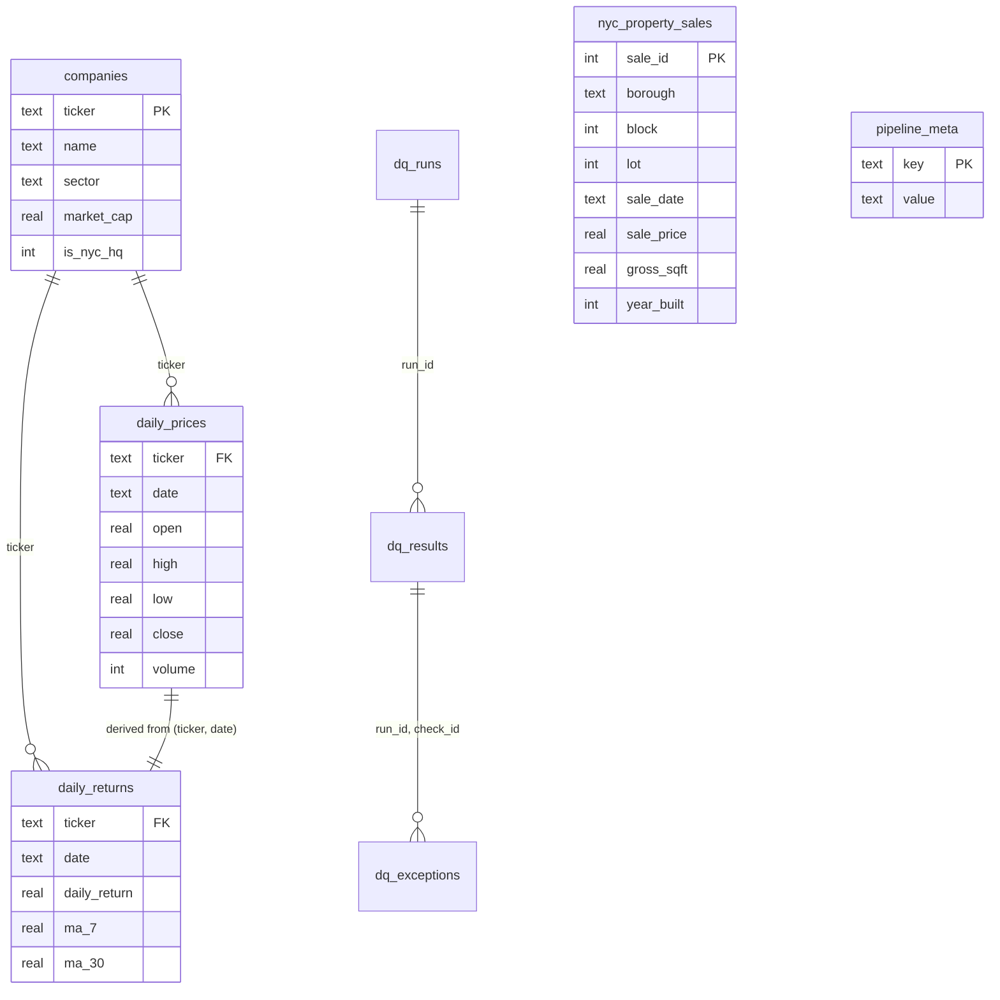

# NYC Financial & Real Estate Data Pipeline

A Python and SQL pipeline that joins a year of daily stock prices for 13 NYC-weighted public companies with 28,329 NYC property sales, measures the quality of both with 16 automated data-quality checks, and asks one question neither dataset can answer alone:

**Do NYC real estate stocks track the NYC property market?**

Not over this window. From September 2016 to August 2017, the three NYC REITs (SL Green, Vornado, Empire State Realty) fell **6.4%** while NYC property prices per square foot rose **14.2%**, or 13.4% after removing the sales the quality checks flagged. Month to month the two series moved somewhat together (a correlation of **0.51** between monthly changes, 0.42 after cleanup), but with only 11 monthly changes neither figure is statistically significant. The likely reason for the gap is that the two sides measure different markets: the REITs mostly own Manhattan office buildings, while 78% of the sales that report square footage are one- and two-family homes outside Manhattan.

The quality checks also produced findings of their own. Of the 18 extreme daily price moves they flagged, 17 fall on a documented earnings release, analyst action or market event, and the one that doesn't is the first I'd check against a second price source ([details](#from-quality-flags-to-market-findings)).

| | |
|---|---|
| **Sources** | 3 public datasets: daily stock prices, S&P 500 company metadata, NYC Department of Finance rolling sales |
| **Model** | 4 core tables, a lineage table, 3 data-quality tables, 1 analysis-ready view (SQLite) |
| **Volume** | 3,276 daily prices · 28,329 property sales kept from 84,548 source records |
| **Data quality** | 16 checks across 5 dimensions. Latest run: 15 pass, 1 warning, 0 fail ([scorecard](reports/dq_scorecard.md)) |
| **Stack** | Python (pandas, NumPy), SQL (CTEs, window functions), SQLite, pytest, GitHub Actions |

I built this after a summer at H&H Metals doing SQL and Power BI reporting on commodities trade data. I wanted to design that kind of transaction-heavy relational model myself, from raw files through to checked, queryable data.

---

## Architecture


Every step logs row counts in and out. Guardrails in `scripts/checks.py` stop the run at each boundary if a load is empty, a key is null or duplicated, or a foreign key is orphaned. The data-quality layer runs after the load and measures what landed.

## Data model



- **Stocks and property sales connect through time, not a key.** The REIT comparison aggregates both to month and joins on it, so the two sources must cover the same months. A data-quality check verifies that on every run.
- **`nyc_property_sales` has a natural key**: borough + block + lot (NYC's parcel ID) + sale date + price, enforced with a `UNIQUE` constraint. `sale_id` is only a surrogate. Without the parcel ID, a repeated record can't be told apart from a separate sale (see below).
- **`pipeline_meta` records provenance** for the current load: whether the data is real or demo, and the ingest lineage counts.
- Full DDL: [`sql/schema.sql`](sql/schema.sql) (core) and [`sql/dq_schema.sql`](sql/dq_schema.sql) (data quality).

---

## Data quality

Quality is handled in two layers with different jobs:

| Layer | Where | When it runs | On a problem |
|---|---|---|---|
| **Guardrails** | `scripts/checks.py` | Inside each pipeline step | Stops the run, so data that fails a guardrail never loads |
| **Measurement** | `scripts/dq_rules.py`, `08_run_data_quality.py` | After the load | Scores every check, stores the results per run, queues flagged records for review, and exits with code 1 if a critical check fails |

The 16 checks are tagged by dimension:

| Dimension | What it asks | Checks |
|---|---|---|
| Completeness | Is everything that should be there, there? | Required fields populated. Every ticker has every trading day. Each borough keeps enough of its source records to be representative. |
| Validity | Do values obey their domain rules? | Low ≤ open/close ≤ high. Positive volume. Known borough, price ≥ $10K, footage > 0. Plausible year built. |
| Uniqueness | Is each real-world event recorded once? | One price per ticker per day. One row per parcel sale. |
| Consistency | Do related tables and sources agree? | Stored returns match returns recomputed in SQL from prices. Every ticker exists in `companies`. Prices and sales cover the same months. Lineage counts reconcile (source − dropped = kept = loaded). |
| Accuracy | Is the value plausible? | Daily returns more than 5 robust z-scores from the stock's median. Price per square foot outside 3× IQR fences for its borough and building class. |

Rule checks are SQL queries that select the rows breaking a rule, so zero rows means pass. Statistical checks use the median and the median absolute deviation instead of mean and standard deviation, because extreme values inflate the standard deviation and hide themselves. Each check has a pass-rate threshold set by how the data is used, so a stock-price rule must hold for 100% of rows, and statistical flags on public property records are tolerated up to 2%. Flagged records aren't deleted. They're written to `dq_exceptions`, and price analysis reads `v_sales_analysis_ready`, which excludes them.

Timeliness isn't measured. The data is a fixed 2016–17 snapshot, so freshness checks belong to a live feed, not this one.

### What the checks found

1. **Only a third of the source file is usable for price-per-square-foot analysis, for two different reasons.** 30.8% of records aren't market sales at all: the price is blank, $0, or under $10,000. (The Department of Finance's example of a $0 sale is a transfer from parents to children.) Another 35.5% are real sales with no square footage, almost all of them condos and co-ops. Every drop is logged with its reason.
2. **107 duplicate records of the same sale.** The source repeats some sales verbatim, and the price and footage filter lets them through. They're now removed at ingest on the natural key, and a uniqueness check guards against their return. Removing them moved the property price trend from +15.9% to +14.2%.
3. **The cleaning step creates its own bias.** Manhattan keeps only 5.0% of its records (922 of 18,306), because condos and co-ops don't report footage. Staten Island keeps 58.3%. The coverage check raises this as a warning on every run, so the caveat travels with any borough comparison.
4. **The market data looks clean.** 18 daily moves were flagged as extreme for their stock. 17 fall on a documented event. The remaining one is the first I'd check against a second price source. The next section has the details.
5. **388 sales (1.4%) have a price per square foot far outside their peer group** (same borough and building class). 369 are far below it and 19 far above (DQ9 in `sql/dq_queries.sql`). The expensive side includes $86M for a 4,960 sq ft Midtown East walk-up ($17,339/sq ft). The cheap side includes $85,000 for a 1,315 sq ft Staten Island house, plus 45 sales that share their date and price with other lots in the same borough, the pattern of one sale covering several lots. Every cheap flag cleared the $10,000 floor and still sits far below comparable sales, which suggests a fixed dollar floor is too blunt a filter. The flagged sales are excluded from price analysis through the view and kept in the table for review.

The latest run's full results are in [`reports/dq_scorecard.md`](reports/dq_scorecard.md).

---

## From quality flags to market findings

For each of the 18 flagged price moves, I asked what happened that day. The answers turned out to be findings about the market. Queries Q15–Q18 in [`sql/queries.sql`](sql/queries.sql) produce every number below.

### 17 of 18 flags have a documented cause

Q15 joins the flags to an event list I checked against earnings releases and news coverage from the day (sources below). Each event is scoped to one ticker, one sector or the whole market, so a tech selloff can't explain a drug maker's move.

| Cause | Flags | Examples |
|---|---:|---|
| Earnings release | 7 | AXP +9.0% on a Q3 2016 beat and raised guidance · AAPL +6.1% on record Q1 FY17 revenue · VZ +7.7% in its first full quarter of unlimited plans · VZ −4.4% on a Q4 2016 miss |
| Market-wide day | 7 on 3 days | The 2016 election (GS, JPM, MS and PFE on 9 Nov; JPM and PFE on 10 Nov) · the Comey memo selloff (JPM, 17 May 2017) |
| Sector day | 2 | Financials fell after Trump called the dollar too strong (JPM, 17 Jan 2017) · tech selloff (AAPL, 9 Jun 2017) |
| Analyst downgrade | 1 | AXP −3.8% when Nomura cut it to Reduce |
| No documented cause | 1 | PFE +3.2% on 9 Jun 2017 |

The PFE move is the one I can't explain. It also traded at only 1.3× its usual volume, the lowest of the 18, so it's the first record I'd check against a second price source.

### Volume is a strong second signal, but not a rule

| | Days | Average volume vs. the prior 20 days | Days at 2× volume or more |
|---|---:|---:|---:|
| Flagged moves | 18 | **3.1×** | 78% |
| Every other day | 3,245 | 1.0× | 2.2% |

A price that's wrong in the file doesn't change how much traded, so a bad print should arrive on ordinary volume. The real data has no confirmed bad print to test that on, so the demo seed plants one to show the pattern (see [How to run](#how-to-run)). Volume can't decide on its own, though: four flags traded below 2×, and three of them are documented events.

### The stock's move versus the market's

Q15 also subtracts the average move of the other 12 tickers from each flagged move. On all seven earnings days, the rest of the basket moved less than 0.7% either way, so the move was the company's own. On market and sector days the split varies. On 17 May 2017, JPM fell 3.8% while the others fell 2.4%, so most of the move was shared. On 9 Jun 2017, AAPL fell 3.9% while the others rose 1.3%, because the selloff was concentrated in technology.

### What this adds to the REIT story

The headline says the REITs fell over the year. The event analysis shows when:

| Period | NYC REITs | NYC financials |
|---|---:|---:|
| Sep 2016 to the election | −12.4% | +4.2% |
| The election to year end | +10.7% | +19.5% |
| 2017 through August | −5.4% | +9.4% |
| *The two trading days after the election* | *+2.2%* | *+8.2%* |

The loss came in three phases, not as a steady decline. The REITs rallied after the election along with the banks, but by less. Across the year, the REITs' daily returns correlate 0.69–0.74 with each other and no more than 0.32 with any other sector in the sample, including 0.12–0.28 with the NYC financials (Q18). They trade as their own group, not with the other NYC-headquartered companies.

*Figures are averages of each ticker's close-to-close return (Q17). That method gives −8.4% for the REITs over the full window, while the −6.4% in the summary averages monthly prices (Q14).*

---

## Other findings

- **The Manhattan-versus-outer-borough gap in sales counts is mostly the filter.** Queens kept 10,762 qualifying sales and Manhattan 922, a gap of nearly 12×. In the source file the gap is 1.5× (26,736 versus 18,306 records).
- **Staten Island's qualifying sales are the newest buildings.** Their average age is 49 years, versus 98 in Manhattan, and 18.4% were built in 2000 or later, more than three times Brooklyn's share. Staten Island is also the only borough where post-2000 buildings sell above prewar ones ($323 versus $304 per sq ft). Everywhere else prewar wins, Manhattan by the widest margin ($1,143 versus $601).

All queries are in [`sql/queries.sql`](sql/queries.sql). Each one opens with the business question it answers.

---

## How to run

```bash
python -m venv .venv && source .venv/bin/activate
pip install -r requirements.txt

# 1. Put the three source files in data/raw/ (see Datasets below)
# 2. Build the database
python scripts/01_ingest_stock_data.py
python scripts/02_ingest_company_data.py
python scripts/03_ingest_nyc_property_data.py
python scripts/04_clean_transform.py
python scripts/05_load_to_sqlite.py

# 3. Measure quality (writes reports/dq_scorecard.md, exit code 1 on a critical failure)
python scripts/08_run_data_quality.py

# 4. Explore
sqlite3 data/processed/financial_re.db < sql/queries.sql
sqlite3 data/processed/financial_re.db < sql/dq_queries.sql
python scripts/06_build_dashboard.py      # output/dashboard.html

# Tests for the data-quality checks
python -m pytest tests/
```

No source files yet? `python scripts/00_demo_seed.py` builds a synthetic database that goes through the same filter, dedupe and lineage as the real ingest, and the dashboard stamps it DEMO. It plants one known defect per statistical check (a market-wide day, an earnings-style jump on heavy volume, a bad print that reverts, multi-lot sales, unit sales with no footage), so `08_run_data_quality.py` shows what each check catches. CI runs this path, the tests and every query on each push.

## Repository layout

```
scripts/   01–05 pipeline, 06 dashboard, 07 live-data prototype, 08 data quality
           00 demo seed, checks.py (guardrails), dq_rules.py (quality checks), utils.py
sql/       schema.sql, dq_schema.sql, queries.sql, dq_queries.sql
tests/     unit tests for the quality checks
reports/   dq_scorecard.md, the latest data-quality run
.github/   CI workflow
```

## Design decisions

- **Provenance is recorded, not inferred.** The ingest step writes a lineage record (source, dropped, kept, duplicate and per-borough counts) that the load stamps into `pipeline_meta`. The database only holds surviving rows, so a count of what was removed has to travel with the data.
- **Flag, don't delete.** Implausible records stay in the base table and are excluded through a view. A reviewer can see exactly what was left out and why.
- **Quality history survives reloads.** The data-quality tables live outside `schema.sql`, so rebuilding the core tables doesn't erase the record of how good the data was.
- **Explainable statistics before machine learning.** Median/MAD and IQR fences can be explained line by line to whoever owns the data. A model-based detector (for example, Isolation Forest) would complement them, not replace them.
- **The two sources are aligned on purpose.** The sales export fixes the window at 2016-09-01 to 2017-08-31, so stock data is clipped at ingest to match.
- **Controls and hand-curation are explicit.** MSFT and AAPL are included as non-NYC comparison stocks. `is_nyc_hq` is hand-tagged because the source has no headquarters field. Empire State Realty isn't in the S&P 500 file, so it's added by hand rather than silently missing.

## Limitations and next steps

- **Snapshot data.** Nothing here is current. `07_ingest_live_nyc_sales.py` is a prototype pull from NYC Open Data that hasn't been tested end to end yet.
- **Short window.** Twelve months gives only 11 monthly changes, too few for the REIT-versus-property correlation to be significant either way.
- **The structural explanation is untested.** An office-only property index would test it directly, but only 218 office-building sales survive the filters (Q20), too few for a reliable monthly average.
- **Multi-lot sales.** Sales that share a date and price across lots should be grouped into one sale before price per square foot is computed. That's the next check to add.
- **Adjusted prices.** The price files are adjusted for splits and dividends, so a close won't match a historical quote (MSFT's recorded high on 21 Oct 2016 is $59.03, while it actually traded as high as $60.45). The analysis uses returns, which adjustment barely affects.
- **The market comparison is a basket, not an index.** "The other 12 tickers" are heavy in financials. Adding SPY as a market benchmark would make the stock-versus-market split more exact.
- **The event list is hand-built.** It lives in Q15, with a source for each entry. The next step is an `events` table loaded from an earnings calendar, plus a volume check in `dq_rules.py`, so flags are explained on each run.
- **What drives the REIT phases is untested.** Interest rates are the obvious candidate. Joining the 10-year Treasury yield (FRED) by date would test it.
- **Second-source reconciliation.** Comparing closing prices against a second vendor would measure accuracy directly instead of by plausibility, starting with the unexplained PFE move.
- **Cloud deployment (planned, not built).** Raw files in S3, the transform in Lambda, and the database in RDS PostgreSQL. Connections already go through `utils.get_connection()`, but the SQL uses SQLite-specific features and would need porting.

## Datasets

- Stock prices: [Huge Stock Market Dataset](https://www.kaggle.com/datasets/borismarjanovic/price-volume-data-for-all-us-stocks-etfs) (Kaggle, Boris Marjanovic)
- Company metadata: [S&P 500 Companies with Financial Information](https://www.kaggle.com/datasets/paytonfisher/sp-500-companies-with-financial-information) (Kaggle, Payton Fisher)
- Property sales: [NYC Property Sales](https://www.kaggle.com/datasets/new-york-city/nyc-property-sales), NYC Department of Finance rolling sales, via Kaggle. Field definitions, including $0 sales: [DOF glossary](https://www.nyc.gov/site/finance/property/glossary-property-sales.page)

Event sources for the flagged moves (Q15):

- Earnings: AXP Q3 2016 ([CNBC](https://www.cnbc.com/2016/10/19/american-express-reports-third-quarter-2016-earnings.html), [Fortune](https://fortune.com/2016/10/20/heres-why-amexs-shares-are-charging-higher)), MSFT FY17 Q1 ([CNBC](https://www.cnbc.com/2016/10/21/microsoft-shares-hit-all-time-high-after-earnings-beat.html)), VZ Q4 2016 ([CNBC](https://www.cnbc.com/2017/01/24/verizon-earnings-86-cents-vs-89-cents-estimate.html)), AAPL Q1 FY17 ([Apple](https://www.apple.com/newsroom/2017/01/apple-reports-record-first-quarter-results/)), AXP Q1 2017 ([Motley Fool](https://www.fool.com/investing/2017/04/20/why-american-express-company-stock-jumped-6-today.aspx)), VZ Q2 2017 ([CNBC](https://www.cnbc.com/2017/07/27/verizon-earnings-q2-2017.html)), AAPL Q3 FY17 ([CNBC](https://www.cnbc.com/2017/08/01/apple-earnings-q3-2017.html))
- Market days: 9 Nov 2016 ([CNBC](https://www.cnbc.com/2016/11/09/us-markets.html)), 10 Nov 2016 ([Reuters via Business Standard](https://www.business-standard.com/amp/article/reuters/trump-bets-blast-dow-to-new-high-bank-sector-hits-2008-levels-116111100077_1.html)), 17 May 2017 ([CNBC](https://www.cnbc.com/2017/05/17/us-markets.html))
- Sector days: 17 Jan 2017 ([CNBC](https://www.cnbc.com/2017/01/17/us-markets.html)), 9 Jun 2017 ([Fortune](https://fortune.com/2017/06/09/apple-amazon-google-stock-crash/))
- Analyst: AXP downgrade, 6 Oct 2016 ([24/7 Wall St.](https://247wallst.com/banking-finance/2016/10/06/why-american-express-shares-may-fall-even-further/))
