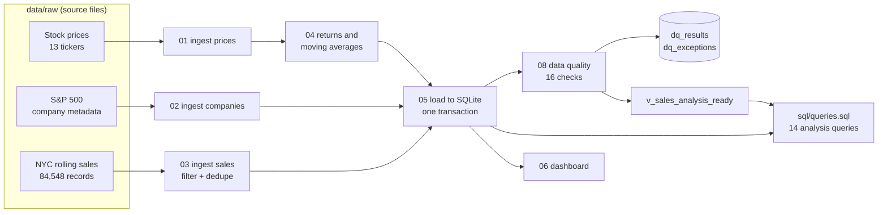
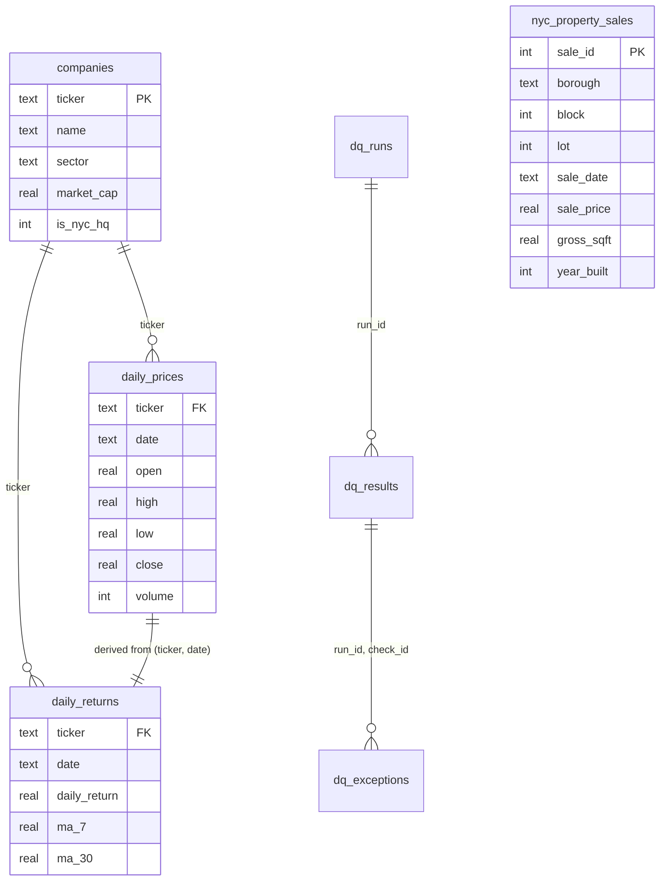

# NYC Financial & Real Estate Data Pipeline

A Python and SQL pipeline that joins a year of daily stock prices for 13 NYC-weighted public companies with 28,329 NYC property sales, measures the quality of both with 16 automated data-quality checks, and asks one question neither dataset can answer alone:

**Do NYC real estate stocks track the NYC property market?**

They don't. From September 2016 to August 2017, the three NYC office REITs (SL Green, Vornado, Empire State Realty) fell **6.4%** while NYC property prices per square foot rose **14.2%**. The monthly correlation is **0.08**, and **0.11** after removing the sales the quality checks flagged, so the conclusion holds after cleanup. With 12 monthly points, neither number is distinguishable from zero. The reason is structural: the REITs are Manhattan office landlords, while the sales that report square footage are mostly outer-borough one- and two-family homes. It's the same city, but a different market.

| | |
|---|---|
| **Sources** | 3 public datasets: daily stock prices, S&P 500 company metadata, NYC Department of Finance rolling sales |
| **Model** | 4 core tables, 3 data-quality tables, 1 analysis-ready view (SQLite) |
| **Volume** | 3,276 daily prices · 28,329 property sales kept from 84,548 source records |
| **Data quality** | 16 checks across 5 dimensions. Latest run: 15 pass, 1 warning, 0 fail ([scorecard](reports/dq_scorecard.md)) |
| **Stack** | Python (pandas, NumPy), SQL (CTEs, window functions), SQLite, pytest |

I built this after a summer at H&H Metals doing SQL and Power BI reporting on commodities trade data. I wanted to design that kind of transaction-heavy relational model myself, from raw files through to checked, queryable data.

---

## Architecture



Every step logs row counts in and out. Guardrails in `scripts/checks.py` stop the run at each boundary if a load is empty, a key is null or duplicated, or a foreign key is orphaned. The data-quality layer runs after the load and measures what landed.

## Data model



- **Stocks and property sales connect through time, not a key.** The REIT comparison aggregates both to month and joins on it, so the two sources must cover the same months. A data-quality check verifies that on every run.
- **`nyc_property_sales` has a natural key**: borough + block + lot (NYC's parcel ID) + sale date + price, enforced with a `UNIQUE` constraint. `sale_id` is only a surrogate. Before I added the natural key, duplicate records of the same sale were impossible to detect (see below).
- Full DDL: [`sql/schema.sql`](sql/schema.sql) (core) and [`sql/dq_schema.sql`](sql/dq_schema.sql) (data quality).

---

## Data quality

Quality is handled in two layers with different jobs:

| Layer | Where | When it runs | On a problem |
|---|---|---|---|
| **Guardrails** | `scripts/checks.py` | Inside each pipeline step | Stops the run, so bad data never loads |
| **Measurement** | `scripts/dq_rules.py`, `08_run_data_quality.py` | After the load | Scores every check, stores the results per run, queues flagged records for review, and exits with code 1 if a critical check fails |

The 16 checks are tagged by dimension:

| Dimension | What it asks | Checks |
|---|---|---|
| Completeness | Is everything that should be there, there? | Required fields populated. Every ticker has every trading day. Each borough keeps enough of its source records to be representative. |
| Validity | Do values obey their domain rules? | Low ≤ open/close ≤ high. Positive volume. Known borough, price ≥ $10K, footage > 0. Plausible year built. |
| Uniqueness | Is each real-world event recorded once? | One price per ticker per day. One row per parcel sale. |
| Consistency | Do related tables and sources agree? | Stored returns match returns recomputed in SQL from prices. Every ticker exists in `companies`. Prices and sales cover the same months. Lineage counts reconcile (source − dropped = kept = loaded). |
| Accuracy | Is the value plausible? | Daily returns more than 5 robust z-scores from the stock's median. Price per square foot outside 3× IQR fences for its borough and building class. |

Rule checks are SQL queries that select the rows breaking a rule, so zero rows means pass. Statistical checks use the median and the median absolute deviation instead of mean and standard deviation, because extreme values inflate the standard deviation and hide themselves. Each check has a pass-rate threshold set by how the data is used, so a stock-price rule must hold for 100% of rows, and statistical flags on public property records are tolerated up to 2%. Flagged records aren't deleted. They're written to `dq_exceptions`, and price analysis reads `v_sales_analysis_ready`, which excludes them.

Timeliness isn't measured. The data is a fixed 2016–17 snapshot, so freshness checks belong to a live feed, not this one.

### What the checks found

1. **Only a third of the source file is usable for price-per-square-foot analysis, for two different reasons.** 30.8% of records aren't market sales at all: the price is blank, $0, or a nominal amount under $10,000 (typically transfers between family members). Another 35.5% are real sales with no square footage, mostly condos and co-ops. Every drop is logged with its reason.
2. **107 duplicate records of the same sale.** The source repeats some sales verbatim, and the original price and footage filter let them through. After I added the natural key, they're removed at ingest and a uniqueness check guards against their return. Removing them moved the property price trend from +15.9% to +14.2%.
3. **The cleaning step creates its own bias.** Manhattan keeps only 5.0% of its records (922 of 18,306), because condos and co-ops don't report footage. Staten Island keeps 58.3%. The coverage check raises this warning on every run, so no one compares borough prices per square foot as if Manhattan were fairly represented.
4. **The market data is clean, and the outlier check shows it.** 18 daily moves were flagged as extreme for their stock. They cluster on real events rather than bad prints: four tickers on 9 Nov 2016 (the day after the US election) and several earnings days. A data error hits one ticker at random, while a market event hits several on the same day. `sql/dq_queries.sql` (DQ4) groups the flags by date to show this.
5. **388 sales (1.4%) have an implausible price per square foot for their peers.** Examples: $86M for a 4,960 sq ft Midtown East walk-up ($17,339/sq ft), and $85,000 for a 1,315 sq ft Staten Island house. Many are likely multi-lot sales recorded against a single lot's footage. They're excluded from price analysis through the view but kept in the table for review.

The latest run's full results are in [`reports/dq_scorecard.md`](reports/dq_scorecard.md).

---

## Other findings

- **The development signal is in volume, not price.** Queens logged 10,762 qualifying sales versus Manhattan's 922.
- **Staten Island is where building happens.** It has the newest housing stock (49 years old on average versus 98 in Manhattan), and 18.4% of its sales were buildings from 2000 or later, more than three times Brooklyn's share. It's also the only borough where new construction sells above prewar ($323 versus $304 per sq ft). Everywhere else prewar wins, Manhattan most dramatically ($1,143 versus $601).

All queries are in [`sql/queries.sql`](sql/queries.sql). Each one opens with the business question it answers.

---

## How to run

```bash
python -m venv .venv && source .venv/bin/activate
pip install -r requirements.txt

# 1. Put the three source files in data/raw/ (see Datasets below)
# 2. Build the database
python scripts/01_ingest_stock_data.py
python scripts/02_ingest_company_data.py
python scripts/03_ingest_nyc_property_data.py
python scripts/04_clean_transform.py
python scripts/05_load_to_sqlite.py

# 3. Measure quality (writes reports/dq_scorecard.md, exit code 1 on a critical failure)
python scripts/08_run_data_quality.py

# 4. Explore
sqlite3 data/processed/financial_re.db < sql/queries.sql
sqlite3 data/processed/financial_re.db < sql/dq_queries.sql
python scripts/06_build_dashboard.py      # output/dashboard.html

# Tests for the data-quality checks
python -m pytest tests/
```

No source files yet? `python scripts/00_demo_seed.py` builds a synthetic database so everything runs, and the dashboard stamps it DEMO.

## Repository layout

```
scripts/   01–05 pipeline, 06 dashboard, 07 live-data prototype, 08 data quality
           checks.py (guardrails), dq_rules.py (quality checks), utils.py
sql/       schema.sql, dq_schema.sql, queries.sql, dq_queries.sql
tests/     unit tests for the quality checks
reports/   dq_scorecard.md, the latest data-quality run
```

## Design decisions

- **Provenance is recorded, not inferred.** The ingest step writes a lineage record (source, dropped, kept, duplicate and per-borough counts) that the load stamps into `pipeline_meta`. The database only holds surviving rows, so a count of what was removed has to travel with the data.
- **Flag, don't delete.** Implausible records stay in the base table and are excluded through a view. A reviewer can see exactly what was left out and why.
- **Quality history survives reloads.** The data-quality tables live outside `schema.sql`, so rebuilding the core tables doesn't erase the record of how good the data was.
- **Explainable statistics before machine learning.** Median/MAD and IQR fences can be explained line by line to whoever owns the data. A model-based detector (for example, Isolation Forest) would complement them, not replace them.
- **The two sources are aligned on purpose.** The sales export fixes the window at 2016-09-01 to 2017-08-31, so stock data is clipped at ingest to match.
- **Controls and hand-curation are explicit.** MSFT and AAPL are a non-NYC control group. `is_nyc_hq` is hand-tagged because the source has no headquarters field. Empire State Realty isn't in the S&P 500 file, so it's added by hand rather than silently missing.

## Limitations and next steps

- **Snapshot data.** Nothing here is current. `07_ingest_live_nyc_sales.py` is a prototype pull from NYC Open Data that hasn't been tested end to end yet.
- **Multi-lot sales.** The city records a portfolio sale's full price on each lot. Detecting these, instead of just catching the extreme ones as outliers, is the next check to add.
- **Second-source reconciliation.** Comparing closing prices against a second vendor would measure accuracy directly instead of by plausibility.
- **Cloud deployment (planned, not built).** Raw files in S3, the transform in Lambda, and the database in RDS PostgreSQL. `utils.get_connection()` is the single point to swap.

## Datasets

- Stock prices: [Huge Stock Market Dataset](https://www.kaggle.com/datasets/borismarjanovic/price-volume-data-for-all-us-stocks-etfs) (Kaggle, Boris Marjanovic)
- Company metadata: [S&P 500 Companies with Financial Information](https://www.kaggle.com/datasets/paytonfisher/sp-500-companies-with-financial-information) (Kaggle, Payton Fisher)
- Property sales: [NYC Property Sales](https://www.kaggle.com/datasets/new-york-city/nyc-property-sales), NYC Department of Finance rolling sales, via Kaggle
